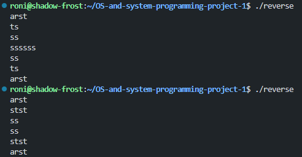

# Project advancement
## Beginning
The project was started with opening my c development environment of choice, which was WSL, creating the test input file, a README.md, a placeholder reverse.c, documentaion folder and checking that everything was up to date and gcc was installed.

After this the repository was pubilshed to GitHub

## code building and testing
Firstly the outline of the project advancement was built by expanding the project summary file.

Secondly I started the coding by implementing features one by one while frequently checking that the edits worked

## Final testing and checking
In this stage all the edeg cases as well as general functionality was tested.

# Working project
## Demonstration of intended behaviour
This contains the program input and output for the intended behaviour
### reverse
shell:
```sh
roni@shadow-frost:~/OS-and-system-programming-project-1$ ./reverse
arst
ts
ss
ssssss
ss
ts
arst
```
for this, see additional edge case at the bottom of this document
### reverse input.txt
input.txt:
```
arstarst
2stst
3rstrst
tsa
```
shell:
```sh
roni@shadow-frost:~/OS-and-system-programming-project-1$ ./reverse input.txt
tsa
3rstrst
2stst
arstarst
```
### reverse input.txt output.txt
input.txt:
```
arstarst
2stst
3rstrst
tsa
```
shell:
```sh
roni@shadow-frost:~/OS-and-system-programming-project-1$ ./reverse input.txt output.txt
```
output.txt:
```
tsa
3rstrst
2stst
arstarst

```
## edge cases
### input is same as output 
shell:
```sh
roni@shadow-frost:~/OS-and-system-programming-project-1$ ./reverse input.txt input.txt
Input and output file must differ
```
### string length
input was set as lingLinesInput.txt from the root of the project
shell:
```sh
roni@shadow-frost:~/OS-and-system-programming-project-1$ ./reverse longLinesInput.txt longLinesOutput.txt
```
output can be found in longLinesOutput.txt at the root of the project
### File length
shell:
```sh
roni@shadow-frost:~/OS-and-system-programming-project-1$ ./reverse manyLineInput.txt manyLineOutput.txt 
```
input and output files can be found at root
### invalid Files
#### invalid input
shell for 1 argument:
```sh
roni@shadow-frost:~/OS-and-system-programming-project-1$ ./reverse arstarst.txgt
error: cannot open file 'arstarst.txgt'
```
shell for 2 arguments:
```sh
roni@shadow-frost:~/OS-and-system-programming-project-1$ ./reverse arstarst.txgt rstgrstgm.txt
error: cannot open file 'arstarst.txgt'
```

#### invalid output
shell:
```sh
roni@shadow-frost:~/OS-and-system-programming-project-1$ ./reverse input.txt /dev/null/output.txt
error: cannot open file '/dev/null/output.txt'
```
### Malloc Fails 
Malloc failures are allways handled. here is one example from code
```c
char *copy = malloc((size_t)linelength + 1);
if (!copy) {
    fprintf(stderr, "malloc failed\n");
    exit(1);
}
```
### Too many arguments
shell:
```sh
roni@shadow-frost:~/OS-and-system-programming-project-1$ ./reverse input.txt output.txt arst
usage: reverse <input> <output>
```
### Error messages
All error messages are addressed previously.

## Additional edgecases
### not ending in input in a newline when using without arguments


One edge case which was not adressed in the instructions is, if the user dosen't end the input in a new line when exiting input. This results in the output starting from the same line, the input ended as can be seen in the first run. if however it ends in a newline, the output starts from the empty line as can be seen in the second example run. 

This was not told to be addressed, so it is left as is and the user is expected to add a newline if they so desire. This however can be easily fixed by either forcing a newline allways or checking if the last character is a newline character.

